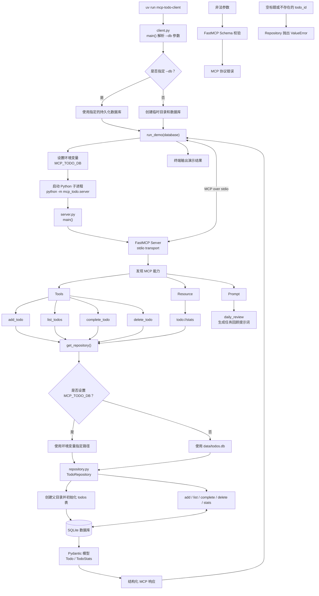

# SQLite Todo MCP Demo

这是一个小型但完整的 [Model Context Protocol](https://modelcontextprotocol.io/) 示例：
MCP Server 将 SQLite 待办事项数据库暴露给 MCP Client 或支持 MCP 的 AI 应用。

完整的架构、组件实现和功能说明见
[项目说明文档](docs/PROJECT_GUIDE.md)。

项目固定使用稳定的 MCP Python SDK 1.x（`mcp>=1.28,<2`），因为 2.x 在本项目
创建时仍是预发布版本。

## 它演示了什么

- `Tools`：创建、查询、完成和删除待办事项
- `Resource`：通过 `todo://stats` 读取统计信息
- `Prompt`：通过 `daily_review` 获取可复用的任务回顾提示词
- 双传输：本地集成使用 `stdio`，跨进程访问使用 Streamable HTTP
- 结构化输出：Python 类型注解自动生成 JSON Schema，结果以结构化数据返回
- 测试：数据层单元测试和内存 MCP 会话集成测试

调用关系如下：

```text
示例 Client / AI 应用
        │  MCP (stdio)
        ▼
FastMCP Server
        │  普通 Python 调用
        ▼
TodoRepository ─── SQLite
```

## 代码运行流程



代码按职责分为三层：`client.py` 负责启动 Server 和演示 MCP 调用，`server.py`
负责将 Tool、Resource、Prompt 转换为业务调用，`repository.py` 负责业务规则和
SQLite 持久化。其中 `daily_review` 只生成提示词，不访问数据库。

## 快速开始

需要 Python 3.10+ 和 [uv](https://docs.astral.sh/uv/)。

```bash
uv sync
uv run mcp-todo-client
```

Client 会启动一个 Server 子进程，列出 Server 提供的工具，然后依次创建、查询、
完成待办事项并读取统计 Resource。默认使用临时数据库，因此可以反复运行。

如需保留数据：

```bash
uv run mcp-todo-client --db ./data/demo.db
```

## 使用 stdio Server

```bash
MCP_TODO_DB=./data/todos.db uv run mcp-todo-server
```

stdio Server 会等待 MCP 消息，不会像普通命令一样输出提示符。支持 MCP 的宿主程序
可以使用如下配置启动它（请将路径替换为项目的绝对路径）：

```json
{
  "mcpServers": {
    "todo": {
      "command": "uv",
      "args": [
        "--directory",
        "/absolute/path/to/mcp-todo-demo",
        "run",
        "mcp-todo-server"
      ],
      "env": {
        "MCP_TODO_DB": "/absolute/path/to/mcp-todo-demo/data/todos.db"
      }
    }
  }
}
```

## 使用 Streamable HTTP Server

在 WSL 中启动常驻 HTTP Server：

```bash
uv run mcp-todo-http \
  --host 127.0.0.1 \
  --port 8000 \
  --db ./data/todos.db
```

也可以通过通用入口显式选择传输：

```bash
uv run mcp-todo-server \
  --transport streamable-http \
  --host 127.0.0.1 \
  --port 8000 \
  --db ./data/todos.db
```

MCP Endpoint 为：

```text
http://localhost:8000/mcp
```

Windows LM Studio 的 `mcp.json` 可以直接连接该地址：

```json
{
  "mcpServers": {
    "todo-http": {
      "url": "http://localhost:8000/mcp"
    }
  }
}
```

这种模式下 Server 由用户在 WSL 中启动，并可持续服务多个 HTTP 连接；LM Studio
不再通过 `wsl.exe` 启动 stdio 子进程。若 Windows 无法通过 localhost 访问 WSL，
可将 Server 绑定到 `0.0.0.0`，再使用 WSL IP 连接。只应在可信网络中开放监听地址。

也可以用 MCP Inspector 交互式查看 Server 的工具、Schema 和返回结果：

```bash
uv run mcp dev src/mcp_todo/server.py
```

## 运行测试

```bash
uv run pytest
```

`test_repository.py` 验证 SQLite CRUD 和错误分支；`test_mcp_server.py` 使用 SDK 官方
的内存传输建立真实 MCP Client/Server 会话，验证工具发现、Schema 参数校验、工具
调用、Resource 和 Prompt；`test_server_cli.py` 验证双传输命令行参数。

## 项目结构

```text
mcp-todo-demo/
├── src/mcp_todo/
│   ├── client.py       # stdio MCP Client 示例
│   ├── repository.py   # SQLite 数据与领域逻辑
│   └── server.py       # MCP Tools、Resource、Prompt
├── tests/
│   ├── test_repository.py
│   ├── test_mcp_server.py
│   └── test_server_cli.py
├── pyproject.toml
└── README.md
```

## MCP 的关键点

Server 中的 `@mcp.tool()` 并不是普通 HTTP 路由。MCP SDK 会读取函数签名、类型注解
和 docstring，自动生成工具名称、参数 JSON Schema 和说明。Client 先执行
`list_tools()` 发现能力，再用 `call_tool(name, arguments)` 调用；二者只依赖 MCP
协议，不需要共享业务代码。因而同一个 Server 可以被不同 AI 宿主复用。
